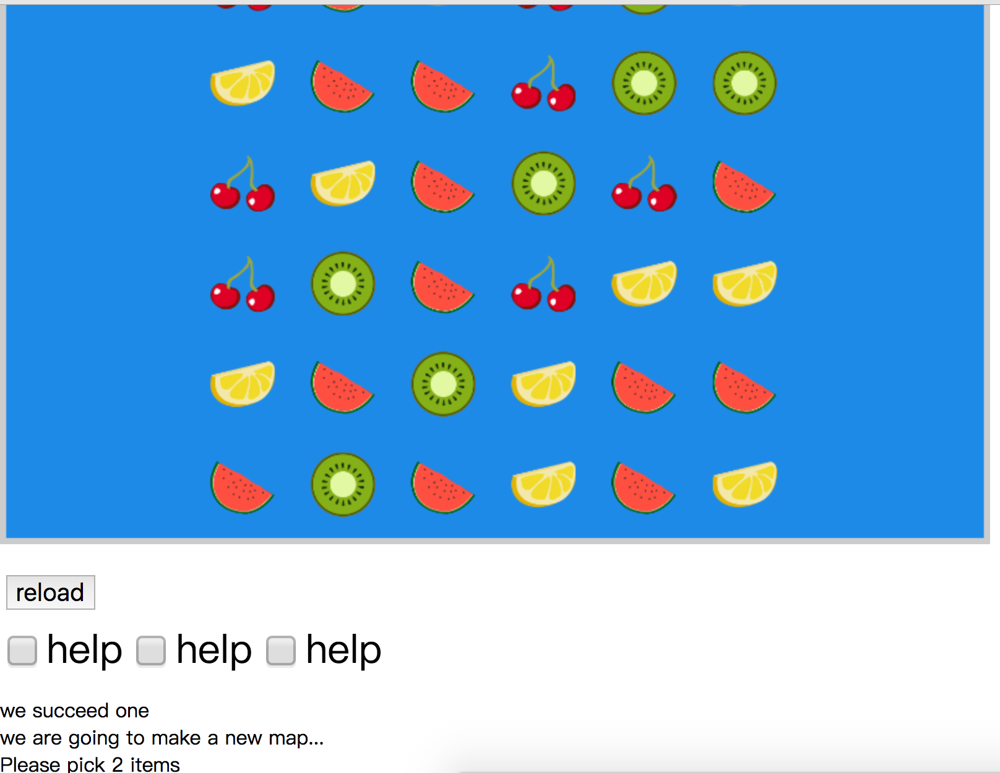

# switching-box

visiting this to play the game:
[switching-box](https://leteno.github.io/Game/switching-box/index.html)

TODO-LIST:

* [ ] Background && soundTrack
* [x] Hint to tell user what to do
* [ ] Good Opening up
* [ ] Score & Record System
* [ ] Customize config
* [ ] change color when moving
* [x] Help System, make it reasonable.
* [x] increase difficulty in next level
* [x] swaping speed accelerate
* [ ] bug on determine position of item (when you touch outside)
* [ ] Add cheat button, to pass it fast(score minus)

THANKS:

* Thanks [themushroomkingdom](https://themushroomkingdom.net) for the mario resources.
  I feel so warm when I heard the 'old' song singing. What an old day.